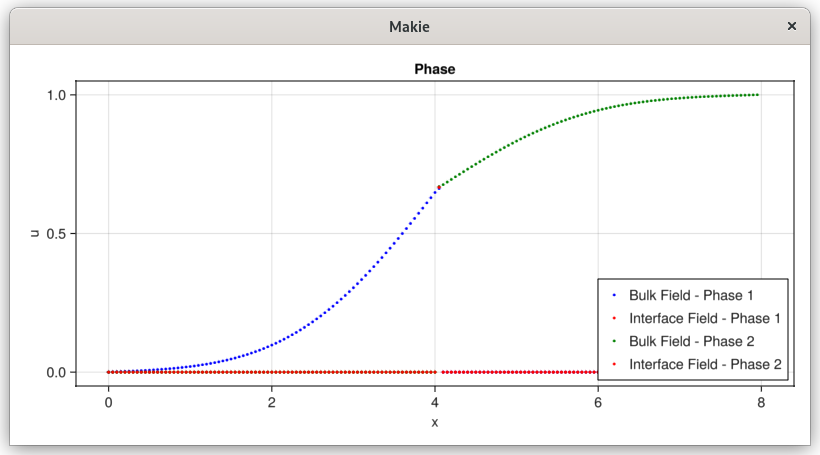
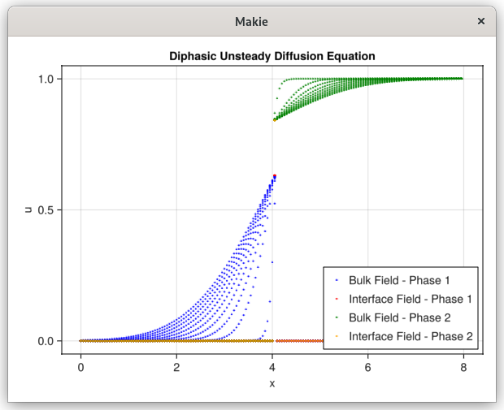

# Heat 1D - 2 phases

This example demonstrates how to solve a 1D Heat equation in two domains with temperature and heat flux jump boundary conditions.
We create two bodies (phases) that share an interface at x = 4.1, allowing for discontinuities in temperature and flux across the boundary.

Here, we create a simple 1D mesh from x = 0.0 to x = 8.0, with 80 intervals (81 nodes). We define two domains (phases). 'body' covers one side of x = 4.1 and 'body_c' covers the other side.
The sign of (x - xint) distinguishes which phase the cell belongs to.
```
# Build mesh
nx = 80
lx = 8.0
x0 = 0.0
mesh = CartesianMesh((nx,), (lx,), (x0,))

# Define the body
xint = 4.0 + 0.1
domain=((x0,lx),)
body = Body((x, _=0) -> (x - xint),(x,_=0)->(x),domain,false)
body_c = Body((x, _=0) -> -(x - xint),(x,_=0)->(x),domain,false)

identify!(mesh, body)
```

For each body, we build a Capacity object (identifying interior, boundary, etc.) and then create
diffusion operators to handle the PDE discretization in each phase.
```
# Define capacity/operator
capacity = Capacity(body, mesh)
capacity_c = Capacity(body_c, mesh)
operator = DiffusionOps(capacity.A, capacity.B, capacity.V, capacity.W, (nx+1,))
operator_c = DiffusionOps(capacity_c.A, capacity_c.B, capacity_c.V, capacity_c.W, (nx+1,))
```

We impose Dirichlet boundary conditions at both ends. Then, we define interface conditions (for jump in temperature and flux).
We set zero source terms for both phases. Finally, we create two Phase objects pointing to their respective capacities/operators.
```
bc1 = Dirichlet(0.0)
bc0 = Dirichlet(1.0)
bc_b = BorderConditions(Dict{Symbol, AbstractBoundary}(:top => bc0, :bottom => bc1))

ic = InterfaceConditions(ScalarJump(1.0, 0.75, 0.0), FluxJump(1.0, 4.0, 0.0))

f1 = (x,y,z,t)->0.0
f2 = (x,y,z,t)->0.0
K = 1.0
Fluide_1 = Phase(capacity, operator, f1, K)
Fluide_2 = Phase(capacity_c, operator_c, f2, K)
```

We build the initial conditions for each phase and concatenate them into one vector.
```
u0ₒ1 = zeros(nx+1)
u0ᵧ1 = zeros(nx+1)
u0ₒ2 = ones(nx+1)
u0ᵧ2 = ones(nx+1)

u0 = vcat(u0ₒ1, u0ᵧ1, u0ₒ2, u0ᵧ2)
```

We set the time step Δt = 0.01 and a final time of Tend = 1.0. Then, we build the unsteady solver for the diphasic case
and solve using the direct “backslash” method. The results (temperatures in each domain and at the interface)
are stored in solver.states over time.
```
Δt = 0.01
Tend = 1.0
solver = DiffusionUnsteadyDiph(Fluide_1, Fluide_2, bc_b, ic, Δt, Tend, u0)
solve_DiffusionUnsteadyDiph!(solver, Fluide_1, Fluide_2, u0, Δt, Tend, bc_b, ic; method=Base.:\)
```



