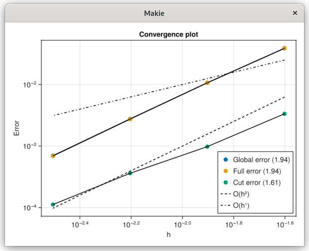

# Heat 2D Dirichlet

This example demonstrates how to solve a 2D diffusion Heat equation inside a circular region with Dirichlet boundary conditions

Here, we create a Cartesian mesh of size nx × ny, and define a circle inside that mesh.
The function identifies cells that lie inside, outside, or on the circular boundary.
```
# Build mesh
nx, ny = 40, 40
lx, ly = 4., 4.
x0, y0 = 0., 0.
domain = ((x0, lx), (y0, ly))
mesh = CartesianMesh((nx, ny), (lx, ly), (x0, y0))

# Define the body
radius, center = ly/4, (2.01, 2.01)
circle = Body(
            (x,y,_=0) -> (sqrt((x-center[1])^2 + (y-center[2])^2) - radius),
            (x,y,_)   -> (x,y),
            domain,
            false)
identify!(mesh, circle)
```

This creates the discrete operators needed to assemble and solve the diffusion equation based on the mesh and the circular domain.

```
# Define capacity/operator
capacity = Capacity(circle, mesh)
operator = DiffusionOps(capacity.A, capacity.B, capacity.V, capacity.W, (nx+1, ny+1))
```

We impose Dirichlet boundary conditions 1.0 on the interface and Dirichlet 0.0 on all edges, define a constant source term f(x,y)=0.0, and set the diffusion coefficient K=1.0.
```
bc = Dirichlet(1.0)
bc0 = Dirichlet(0.0)
bc_b = BorderConditions(Dict{Symbol, AbstractBoundary}(:left => bc0, 
        :right => bc0, 
        :top => bc0, 
        :bottom => bc0))


f = (x,y,_)->0.0
K = 1.0
phase = Phase(capacity, operator, f, K)
```

We build the initial conditions for the phase and concatenate them into one vector.
```
u0ₒ = ones((nx+1)*(ny+1))
u0ᵧ = ones((nx+1)*(ny+1))
u0 = vcat(u0ₒ, u0ᵧ)

```

We set the time step Δt and a final time of Tend. Then, we build the unsteady solver for the monophasic case
and solve using the direct “backslash” method. The results (temperatures in the domain and at the interface)
are stored in solver.states over time.
```
Δt = 0.5*(lx/nx)^2
Tend = 1.0
solver = DiffusionUnsteadyMono(Fluide, bc_b, bc, Δt, Tend, u0, "BE")
solve_DiffusionUnsteadyMono!(solver, Fluide, u0, Δt, Tend, bc_b, bc, "BE"; method=Base.:\)
```

The analytical solution is computed like this : 
```
function radial_heat_xy(x, y)
    t=Tend
    R=1.0

    function j0_zeros(N; guess_shift=0.25)
        zs = zeros(Float64, N)
        # The m-th zero of J₀ is *roughly* near (m - guess_shift)*π for large m.
        # We'll bracket around that approximate location and refine via find_zero.
        for m in 1:N
            # approximate location
            x_left  = (m - guess_shift - 0.5)*pi
            x_right = (m - guess_shift + 0.5)*pi
            # ensure left>0
            x_left = max(x_left, 1e-6)
            
            # We'll use bisection or Brent's method from Roots.jl
            αm = find_zero(besselj0, (x_left, x_right))
            zs[m] = αm
        end
        return zs
    end

    alphas = j0_zeros(1000)
    N=length(alphas)
    r = sqrt((x - center[1])^2 + (y - center[2])^2)
    if r >= R
        # Not physically in the domain, so return NaN or handle as you wish.
        return NaN
    end
    
    # If in the disk: sum the series
    s = 0.0
    for m in 1:N
        αm = alphas[m]
        s += exp(-αm^2 * t) * besselj0(αm * (r / R)) / (αm * besselj1(αm))
    end
    return 1.0 - 2.0*s
end
```


L2 Norm Error


Linf Norm Error

