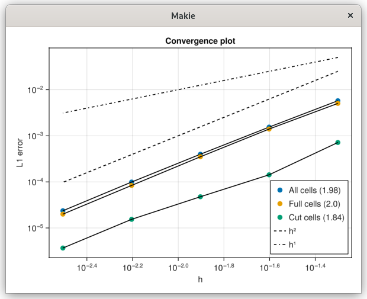
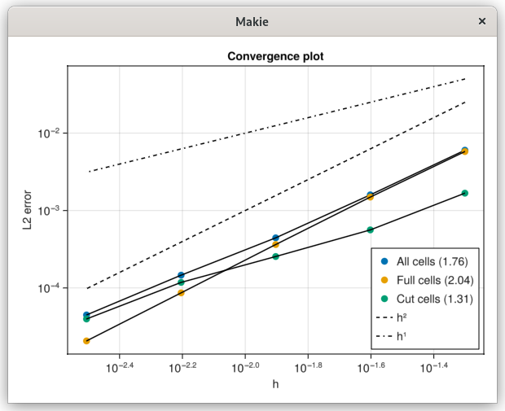

# Poisson 2D

This example demonstrates how to solve a 2D diffusion (Poisson) equation inside a circular region.

Here, we create a Cartesian mesh of size nx × ny, and define a circle inside that mesh.
The function identifies cells that lie inside, outside, or on the circular boundary.
```
# Build mesh
nx, ny = 160, 160
x0, y0 = 0.0, 0.0
lx, ly = 4., 4.
mesh = CartesianMesh((nx, ny), (lx, ly), (x0, y0))

# Define the body
radius, center = ly/4, (2.01, 2.01)
circle = Body(
            (x,y,_=0) -> (sqrt((x-center[1])^2 + (y-center[2])^2) - radius),
            (x,y,_)   -> (x,y),
            ((x0,lx), (y0,ly)),
            false)
```

This creates the discrete operators needed to assemble and solve the diffusion equation based on the mesh and the circular domain.

```
# Define capacity/operator
capacity = Capacity(circle, mesh)
operator = DiffusionOps(capacity.A, capacity.B, capacity.V, capacity.W, (nx+1, ny+1))
```

We impose Dirichlet boundary conditions of 0.0 on all edges, define a constant source term f(x,y)=4.0, and set the diffusion coefficient K=1.0.
```
bc_interface = Dirichlet(0.0)
bc_b = BorderConditions(Dict(
    :left   => Dirichlet(0.0),
    :right  => Dirichlet(0.0),
    :top    => Dirichlet(0.0),
    :bottom => Dirichlet(0.0)))

f = (x,y,_)->4.0
K = 1.0
phase = Phase(capacity, operator, f, K)
```

The solver is constructed and run using a direct solver (the “backslash” operator). The numerical solution is stored in solver.x.
```
solver = DiffusionSteadyMono(phase, bc_b, bc_interface)
solve_DiffusionSteadyMono!(solver, phase; method=Base.:\)
```

These plots show the error distribution in log scale and the L1/L2 norms for different mesh sizes, demonstrating the convergence characteristics of the solver.


