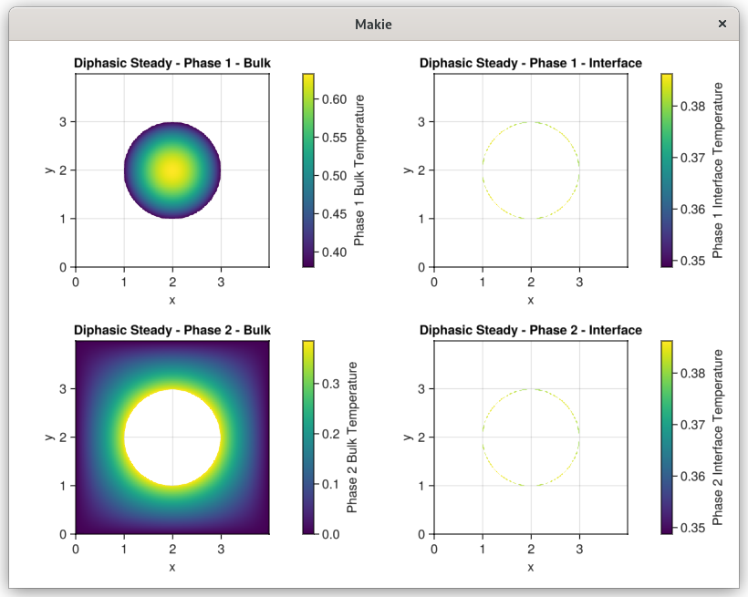

# Poisson 2D

This example demonstrates how to solve a 2D diffusion (Poisson) equation between two domains.

Here, we create a Cartesian mesh of size nx × ny, and define a circle inside that mesh.
The function identifies cells that lie inside, outside, or on the circular boundary.
```
# Build mesh
nx, ny = 320, 320
lx, ly = 4., 4.
x0, y0 = 0., 0.
domain = ((x0, lx), (y0, ly))
mesh = CartesianMesh((nx, ny), (lx, ly), (x0, y0))

# Define the body
radius, center = ly/4, (lx/2, ly/2) .+ (0.01, 0.01)
circle = Body((x,y,_=0)->sqrt((x-center[1])^2 + (y-center[2])^2) - radius, (x,y,_)->(x,y), domain, false)
circle_c = Body((x,y,_=0)->-(sqrt((x-center[1])^2 + (y-center[2])^2) - radius), (x,y,_)->(x,y), domain, false)
identify!(mesh, circle)
```

This creates the discrete operators needed to assemble and solve the diffusion equation based on the mesh and the circular domain.

```
# Define capacity/operator
capacity = Capacity(circle, mesh)
capacity_c = Capacity(circle_c, mesh)
operator = DiffusionOps(capacity.A, capacity.B, capacity.V, capacity.W, (nx+1, ny+1))
operator_c = DiffusionOps(capacity_c.A, capacity_c.B, capacity_c.V, capacity_c.W, (nx+1, ny+1))
```

We impose Dirichlet boundary conditions of 0.0 on all edges, define a constant source term f(x,y)=4.0, and set the diffusion coefficient K=1.0.
```
bc_b = BorderConditions(Dict(
    :left   => Dirichlet(0.0),
    :right  => Dirichlet(0.0),
    :top    => Dirichlet(0.0),
    :bottom => Dirichlet(0.0)))

ic = InterfaceConditions(ScalarJump(1.0, 1.0, 0.0), FluxJump(1.0, 1.0, 0.0))

f1 = (x,y,_)->1.0
f2 = (x,y,_)->0.0
K = 1.0
Fluide_1 = Phase(capacity, operator, f1, 1.0)
Fluide_2 = Phase(capacity_c, operator_c, f2, 1.0)
```

The solver is constructed and run using a direct solver (the “backslash” operator). The numerical solution is stored in solver.x.
```
solver = DiffusionSteadyDiph(Fluide_1, Fluide_2, bc_b, ic)
solve_DiffusionSteadyDiph!(solver, Fluide_1, Fluide_2; method=method=Base.:\)
```

