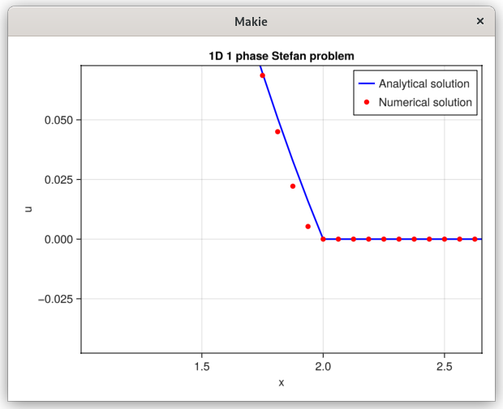

# Stefan 1D 1phase

This example demonstrates how to solve a 1D diffusion Heat equation with a moving boundary.
It's the classical melting problem. The motion is here prescribed.

Here, we create a Cartesian mesh of size nx, and define a body inside that mesh.
The function identifies cells that lie inside, outside, or on the circular boundary.
```
# Build mesh
nx = 20
lx = 10.
x0 = 0.
domain = ((x0, lx),)
mesh = CartesianMesh((nx,), (lx,), (x0,))

# Define the time mesh
Δt = 0.01
Tend = 1.0
nt = Int(Tend/Δt)
t = [i*Δt for i in 0:nt]

# Define the space-time mesh
spaceTimeMesh = CartesianSpaceTimeMesh(mesh, t[1:2])
```

```
# Define the body
xf = 0.1*lx   # Interface position
c = 1.0     # Interface velocity
initial_body = Body((x,_=0)->(x - xf), (x,_)->(x), domain, false)  # Initial body
body = Body((x,t, _=0)->(x - xf - c*sqrt(t)), (x,)->(x,), domain, false)  # Body moving to the right

identify!(mesh, initial_body)
spaceTimeMesh.tag = mesh.tag
```

This creates the discrete operators needed to assemble and solve the diffusion equation based on the mesh and the circular domain.

```
# Define the capacity
capacity = Capacity(body, spaceTimeMesh)
capacity_init = Capacity(initial_body, mesh)

# Define the operators
operator = SpaceTimeOps(capacity.A, capacity.B, capacity.V, capacity.W, (nx+1, 2))
operator_init = DiffusionOps(capacity_init.A, capacity_init.B, capacity_init.V, capacity_init.W, (nx+1,))

```

We impose Dirichlet boundary conditions 0.0 on the interface and Dirichlet 0.0 on all edges, define a constant source term f(x,y)=0.0, and set the diffusion coefficient K=1.0.
```
bc = Dirichlet(0.0)
bc_b = BorderConditions(Dict{Symbol, AbstractBoundary}(:top => Dirichlet(0.0), 
            :bottom => Dirichlet(1.0)))


f = (x,y,z,t) -> 0.0
K = 1.0
Fluide = Phase(capacity, operator, f, K)
```

We build the initial conditions for the phase and concatenate them into one vector.
```
u0ₒ = zeros((nx+1))
u0ᵧ = zeros((nx+1))
u0 = vcat(u0ₒ, u0ᵧ)

```

We set the time step Δt and a final time of Tend. Then, we build the unsteady solver for the monophasic moving case
and solve using the direct “backslash” method. The results (temperatures in the domain and at the interface)
are stored in solver.states over time.
```
solver = MovingDiffusionUnsteadyMono(Fluide, bc_b, bc, Δt, Tend, u0, "CN")
solve_MovingDiffusionUnsteadyMono!(solver, Fluide, u0, Δt, Tend, nt, bc_b, bc, body, mesh, t, "CN"; method=Base.:\)

```



